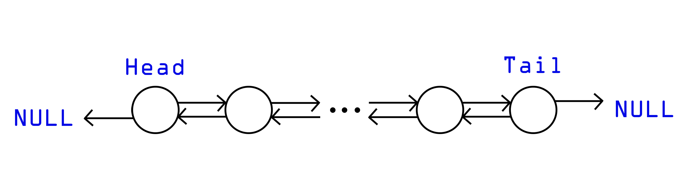
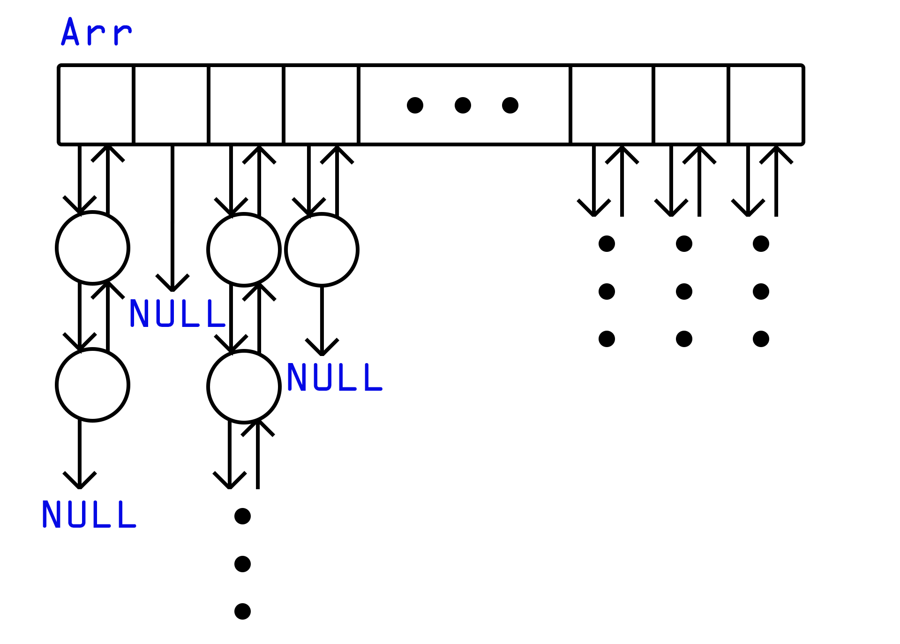

# __Re-reference interval prediction (RRIP) cache__

## __Project description__
This project is a final task of [Konstantin Vladimirov](https://github.com/tilir) C graduate course in MIPT. Initially this project is done in groups of 3 people and you can find very first version of RRIP cache [here](https://github.com/Ignitor21/RRIP-cache). Current project is my own continuation of past group work.

### __Aims__:
* Implement RRIP cache;
* Implement LRU(Least recently used) cache;
* Compare both caches;
* Make conclusions about efficiency of both strategy;

## __Theory introduction__
Wikipedia says that [cache](https://en.wikipedia.org/wiki/Cache_(computing)) is a hardware or software component that stores data so that future requests for that data can be served faster. In this project we suppose that we have stream of some Internet pages with natural numbers which we put in cache and after a while oust them. There are a lot of cache policies and in this project 2 of them  are implemented: RRIP and LRU. Nearby there are some descriptions of each algorithm.

### __LRU:__
1. Scan new page
2. If there is no such page in cache(cache miss) go to step 3, else (cache hit) go to step 4;
3. If cache is full, oust head of the cache(first element) and add new node at the tail of cache(last element). If there are some free space, add new page at the end. Go to step 1;
4. If page is cached, move that at the cache end. Go to step 1.

RRIP policy assumes every cache node has own Re-reference prediction value(RRPV). In current implementation RRPV has 0-3 range value. It means that page with RRPV equals to 0 will be requested earlier than page which RRPV equals to 3. Initially all pages RRPVs equals to 3.

### __RRIP__:
1. Scan new page
2. If there is no such page in cache(cache miss) go to step 3, else (cache hit) go to step 6;
3. Search first element with RRPV equals to 3.
4. If there is no such elements, increment all RRPVs. Go to step 3.
5. If such element exists, replace it with new page and set it's RRPV to 2. Go to step 1.
6. Just set RRPV of this page to 0. Go to step 1.

## __Data structures__
Let's talk about data structures that will be convenient to use. First of all we use __double-linked list__ to imply cache.

### __Double linked list__
We use such data structure instead of array because list has fast insertion, deletion and rearrangement of elements.

But list have one problem: if we want to know is page cached or not, we have to walk through all the elements. Thus it will cost O(n). We don't want to spend this time for search. In this case __hash-table__ will help us!  

### __Hash-table__

Hash-table is implemented as an array of structures which contents pointers to elements of cache and pointers to previous and next hash nodes. These pointers are used in case of hash function collisions. We can imagine hash-table like these:

So there is also double linked list. Using this data structure we find out if page cached or not in O(1*). Star means collisions of hash function.

## __Auto build__
To run these project on your computer write these commands in your console: 

1. `git clone git@github.com:Ignitor21/MyRRIP.git`
2. `cd MyRRIP`
3. `make test` to start end-to-end tests from directory `tests`
4. `make clean` to delete object and executable files.
   
### Extra make options:
* `make execute_rrip` to start execution of RRIP;
* `make execute_lru` to start execution of LRU;
* `make rrip` to create executable file for RRIP;
* `make lru` to create executable file for LRU;

_Продолжение следует..._